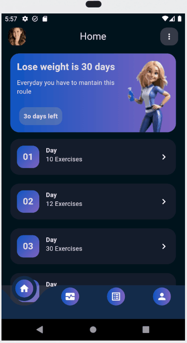

# Health App UI

Este proyecto es **únicamete un frontend desarrollado en Flutter.** La interfaz de usuario se inspiró en el diseño realizado por [Sudarsan Roy](https://dribbble.com/shots/25639336-Health-Care-Mobile-App-UI-UX?utm_source=Clipboard_Shot&utm_campaign=sudarshanroy009&utm_content=Health%20Care%20Mobile%20App%20UI%2FUX&utm_medium=Social_Share&utm_source=Clipboard_Shot&utm_campaign=sudarshanroy009&utm_content=Health%20Care%20Mobile%20App%20UI%2FUX&utm_medium=Social_Share). El resultado se puede visualizar en el siguiente gif:

<table>
<tr>
<td>
</img>
</td>
</tr>
</table>